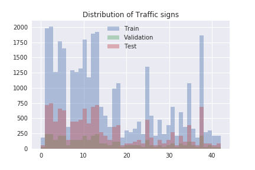
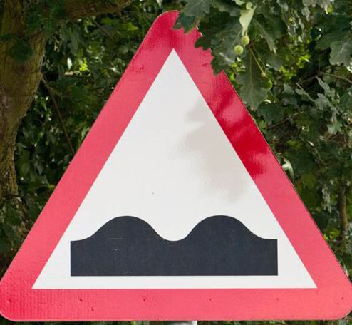
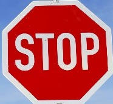
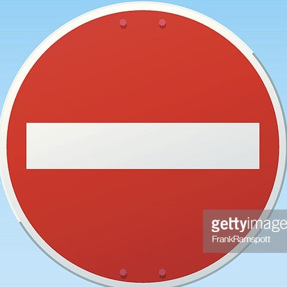
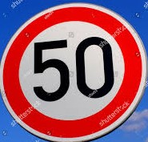
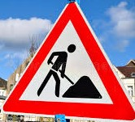

# **Traffic Sign Recognition** 

## Writeup

**Build a Traffic Sign Recognition Project**

The goals / steps of this project are the following:
* Load the data set (see below for links to the project data set)
* Explore, summarize and visualize the data set
* Design, train and test a model architecture
* Use the model to make predictions on new images
* Analyze the softmax probabilities of the new images
* Summarize the results with a written report

#### 1. Provide a Writeup / README that includes all the rubric points and how you addressed each one. You can submit your writeup as markdown or pdf. You can use this template as a guide for writing the report. The submission includes the project code.

You're reading it! and here is a link to my [project code](https://github.com/shankarpandala/CarND-Traffic-Sign-Classifier-Project/blob/master/Traffic_Sign_Classifier.ipynb)

### Data Set Summary & Exploration

#### 1. Provide a basic summary of the data set. In the code, the analysis should be done using python, numpy and/or pandas methods rather than hardcoding results manually.

I used the pandas library to calculate summary statistics of the traffic
signs data set:

* The size of training set is 34799
* The size of the validation set is 4410
* The size of test set is 12630
* The shape of a traffic sign image is (32, 32, 3)
* The number of unique classes/labels in the data set is 43

#### 2. Include an exploratory visualization of the dataset.

Here is an exploratory visualization of the data set. It is a bar chart showing how the data ...



### Design and Test a Model Architecture

#### 1. Describe how you preprocessed the image data. What techniques were chosen and why did you choose these techniques? Consider including images showing the output of each preprocessing technique. Pre-processing refers to techniques such as converting to grayscale, normalization, etc. (OPTIONAL: As described in the "Stand Out Suggestions" part of the rubric, if you generated additional data for training, describe why you decided to generate additional data, how you generated the data, and provide example images of the additional data. Then describe the characteristics of the augmented training set like number of images in the set, number of images for each class, etc.)

Function normalize takes image dataset as input and convert each pixel in range of -1 to 1

* Normalizing value of each pixel in range of -1 to 1. ((pixel-128)/128)


#### 2. Describe what your final model architecture looks like including model type, layers, layer sizes, connectivity, etc.) Consider including a diagram and/or table describing the final model.

My final model consisted of the following layers:

| Layer         		|     Description	        					| 
|:---------------------:|:---------------------------------------------:| 
| Input         		| 32x32x3 RGB image   							| 
| Convolution 5x5     	| 1x1 stride, valid padding, outputs 28x28x6 	|
| RELU					|												|
| Convolution 5x5     	| 2x2 stride, valid padding, outputs 14x14x10 	|
| RELU					|												|
| Convolution 5x5     	| 1x1 stride, valid padding, outputs 8x8x16 	|
| RELU					|												|
| Max Pooling       	| 2x2 stride, valid padding, outputs 4x4x16 	|
| Flatten				|	outputs 256									|
| Fully Connected     	| Input 256 and outputs 120                 	|
| RELU					|												|
| Dropout				|	keep_prob=0.5								|
| Fully Connected     	| Inputs 120 and outputs 100                 	|
| RELU					|												|
| Fully Connected     	| Inputs 120 and outputs 100                 	|
| RELU					|												|
| Fully Connected     	| Inputs 84 and outputs 43                  	|

#### 3. Describe how you trained your model. The discussion can include the type of optimizer, the batch size, number of epochs and any hyperparameters such as learning rate.

To train the model, 
* I used an AdamOptimizer
* batch size : 128
* epohs : 50
* Learning Rate - 0.0009
* dropout keep probability - 0.5


#### 4. Describe the approach taken for finding a solution and getting the validation set accuracy to be at least 0.93. Include in the discussion the results on the training, validation and test sets and where in the code these were calculated. Your approach may have been an iterative process, in which case, outline the steps you took to get to the final solution and why you chose those steps. Perhaps your solution involved an already well known implementation or architecture. In this case, discuss why you think the architecture is suitable for the current problem.

My final model results were:

* Validation Set Accuracy: 94.2%

* Test Set Accuracy: 93.2%

* In the begining, I used the same LeNet Architecture used in the class withouot any changes. But, I didn't get accuracy beyond 89% while using that architecture.


* Architecture is modified as shown in the previous cell to fit our requirements. Dropout is added to prevent from overfitting.

* Able to get 94.2% accuracy for validation and 93.2% for test accuracy.

### Test a Model on New Images

#### 1. Choose five German traffic signs found on the web and provide them in the report. For each image, discuss what quality or qualities might be difficult to classify.

Here are five German traffic signs that I found on the web:

   
 


#### 2. Discuss the model's predictions on these new traffic signs and compare the results to predicting on the test set. At a minimum, discuss what the predictions were, the accuracy on these new predictions, and compare the accuracy to the accuracy on the test set (OPTIONAL: Discuss the results in more detail as described in the "Stand Out Suggestions" part of the rubric).

Here are the results of the prediction:

| Image			        |     Prediction	        					| 
|:---------------------:|:---------------------------------------------:| 
| 2      		        | 40   									        | 
| 17     			    | 17 										    |
| 14					| 14											|
| 25	      		    | 25					 				        |
| 22			        | 25      							            |


The model was able to correctly guess 3 of the 5 traffic signs, which gives an accuracy of 60%. 

#### 3. Describe how certain the model is when predicting on each of the five new images by looking at the softmax probabilities for each prediction. Provide the top 5 softmax probabilities for each image along with the sign type of each probability. (OPTIONAL: as described in the "Stand Out Suggestions" part of the rubric, visualizations can also be provided such as bar charts)

These are the top 5 probabilities

```[[  9.99533057e-01,   3.23854241e-04,   1.42634744e-04,
          4.26526725e-07,   4.03706260e-08],
       [  1.00000000e+00,   2.32806348e-20,   1.05016023e-22,
          2.50751351e-24,   3.19389812e-25],
       [  9.99999523e-01,   4.85392661e-07,   8.42186210e-10,
          1.23385529e-11,   6.34841225e-12],
       [  1.00000000e+00,   8.05584002e-11,   5.65961022e-14,
          1.02424605e-14,   7.93789049e-15],
       [  9.14405584e-01,   5.52979596e-02,   2.75928471e-02,
          1.32631836e-03,   8.16043641e-04]]```
          
These are corresponding classes of probabilities

``` [[40, 38,  1, 37, 39],
       [17, 14,  0, 12, 29],
       [14, 32,  0,  1, 18],
       [25, 26, 22, 29, 20],
       [25, 35, 20, 22, 29]]```


```python

```
